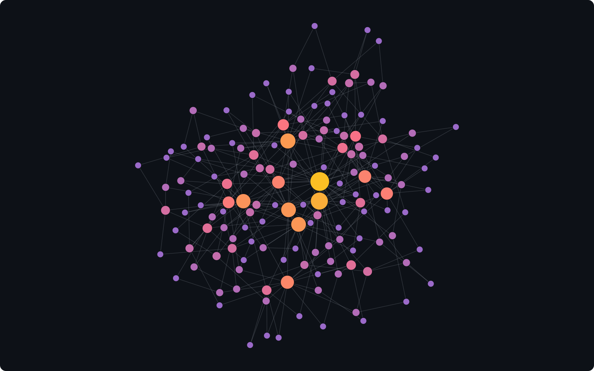
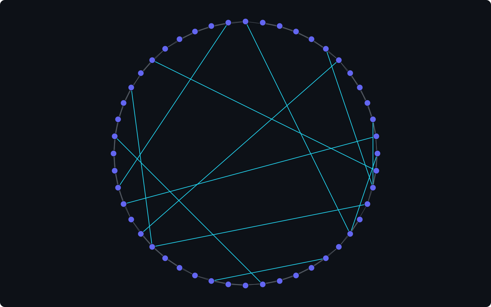
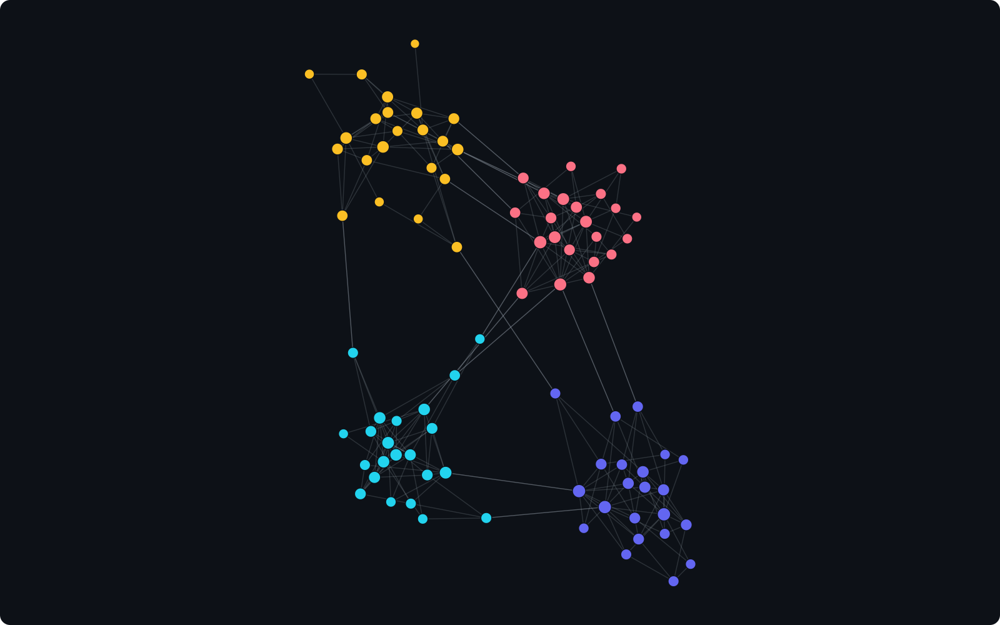
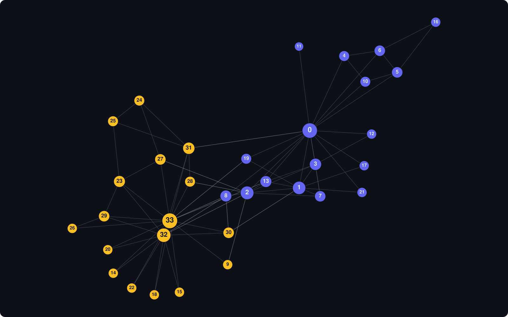

# gonx

A performance-oriented graph library for Go, in the spirit of Python's
[networkx](https://networkx.org/) but built around dense integer node IDs and a
compact, cache-friendly representation.

`gonx` targets workloads that build a graph once and then read it intensively —
agent-based simulations, network metrics, repeated traversals. It separates
mutation from reading: a `Builder` assembles the topology, then freezes into an
immutable `Graph` stored in [Compressed Sparse Row](https://en.wikipedia.org/wiki/Sparse_matrix#Compressed_sparse_row_(CSR,_CRS_or_Yale_format))
form for zero-copy, O(1) neighbor iteration.

```go
import (
    "github.com/LuisLSousa/gonx"
    "github.com/LuisLSousa/gonx/generators"
    "github.com/LuisLSousa/gonx/metrics"
)

r := gonx.NewRand(42)                                  // reproducible PCG RNG
g, _ := generators.WattsStrogatz(1000, 8, 0.1, r)      // small-world graph

apl, _ := metrics.AveragePathLength(g)                 // parallel all-pairs BFS
cc := metrics.Transitivity(g)                          // global clustering

for u := range g.Nodes() {
    for _, v := range g.Neighbors(u) {                 // zero-alloc, cache-friendly
        _ = v
    }
}
```

## Gallery

Every image below is produced by a runnable example in [`examples/`](examples/):
gonx builds the graph, and a small dependency-free helper
([`examples/internal/render`](examples/internal/render)) does the force-directed
layout and writes the SVG. Regenerate any of them from the repo root, e.g.
`go run ./examples/scalefree`.



**Scale-free network** — Barabási–Albert preferential attachment; nodes sized and
colored by degree, so the hubs glow.

```go
r := gonx.NewRand(7)
g, _ := generators.BarabasiAlbert(150, 2, r) // 150 nodes, 2 edges per arrival
```



**Small-world network** — Watts–Strogatz ring lattice with 12% of edges rewired;
the long-range shortcuts that collapse path lengths are drawn in cyan.

```go
r := gonx.NewRand(11)
g, _ := generators.WattsStrogatz(48, 4, 0.12, r) // k=4 ring, p=0.12 rewiring
```



**Community structure** — a planted partition assembled with `Builder`: four dense
blocks with sparse bridges between them, colored by block.

```go
b := gonx.NewBuilder(88) // 4 blocks of 22 nodes
for u := 0; u < 88; u++ {
    for v := u + 1; v < 88; v++ {
        p := 0.005                       // sparse between blocks...
        if u/22 == v/22 { p = 0.28 }     // ...dense inside them
        if r.Float64() < p { b.AddEdge(u, v) }
    }
}
g := b.Build()
```



**Zachary's Karate Club** — the classic 34-member social network, colored by the
faction each member joined after the club split (indigo: Mr. Hi, node 0; amber:
the Officer, node 33) and sized by degree.

```go
b := gonx.NewBuilder(34)
for _, e := range zacharyEdges { // the standard 78-edge list
    b.AddEdge(e[0], e[1])
}
g := b.Build()
```

## Design

- **Dense integer nodes.** IDs are `0..N-1`. No generic node types in the core —
  that would reintroduce a map indirection and defeat CSR's locality. A labeled
  wrapper can sit on top if needed.
- **Immutable `Graph` (CSR).** Neighbors of `u` live in a contiguous, sorted slice
  returned zero-copy by `Neighbors(u)`. `HasEdge` is O(log deg) via binary search.
- **Mutable `Builder`.** Add/remove nodes and edges, then `Build()` to freeze.
  The result is always simple (no self-loops or duplicate edges).
- **Reproducible randomness.** Every randomized operation takes an explicit
  `*math/rand/v2.Rand`. Same seed + parameters ⇒ byte-identical graph. The package
  never touches a global RNG.
- **Parallel where it pays.** All-pairs shortest paths and triangle counting are
  parallelized over independent source nodes with order-independent reductions, so
  results are deterministic regardless of `GOMAXPROCS`. Generators and edge swaps
  are inherently sequential and kept single-threaded.

## Packages

| Package | Contents |
|---|---|
| `gonx` | `Graph` (CSR), `Builder`, iterators, `NewRand` |
| `gonx/generators` | `WattsStrogatz`, `BarabasiAlbert`, `Complete`, `RandomAvgDegree`, `ErdosRenyi` |
| `gonx/transform` | `DoubleEdgeSwap`, `RelabelNodes`, `Shuffle`, `Copy` |
| `gonx/metrics` | `Transitivity`, `AverageClustering`, `AveragePathLength`(+`LCC`), `Diameter`, `ConnectedComponents`, `IsConnected`, `BFS` |

> Note on `BarabasiAlbert(n, m, r)`: `m` is the number of edges added per new node
> (matching networkx), **not** the average degree — the resulting average degree
> is approximately `2m`.

## Status

v1 focuses on undirected, unweighted graphs. Directed/weighted graphs, generic
node labels, serialization, and advanced algorithms (centralities, community
detection) are intentionally out of scope for now.

## Testing

```sh
go test ./... -race        # unit, property, determinism, known-value tests
go test -bench . -benchmem  # benchmarks
go test -fuzz FuzzDoubleEdgeSwap ./transform   # degree-preservation fuzzing
```

## License

MIT — see [LICENSE](LICENSE).
