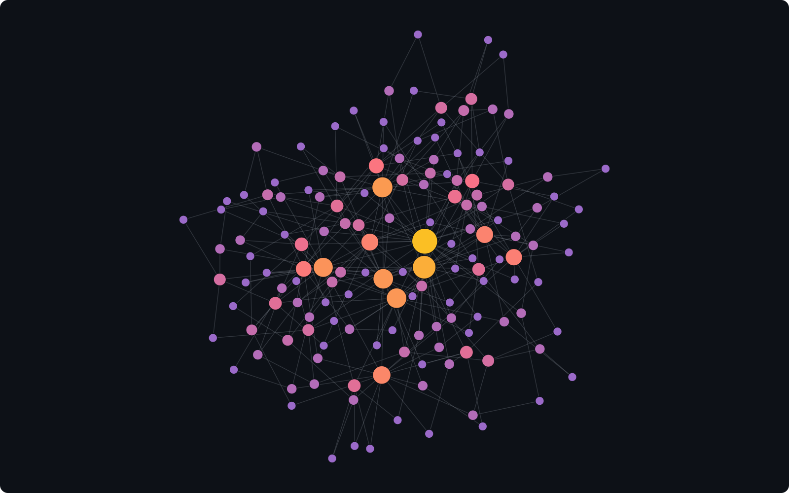
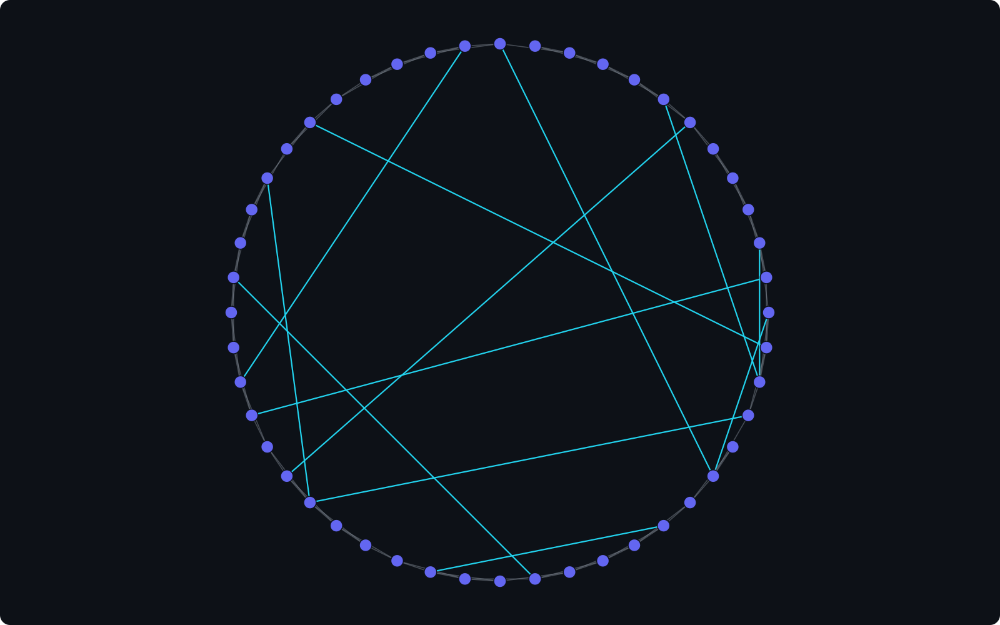
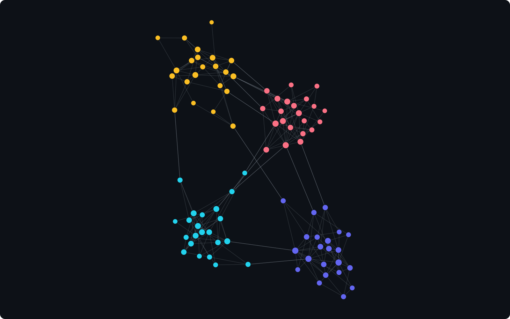
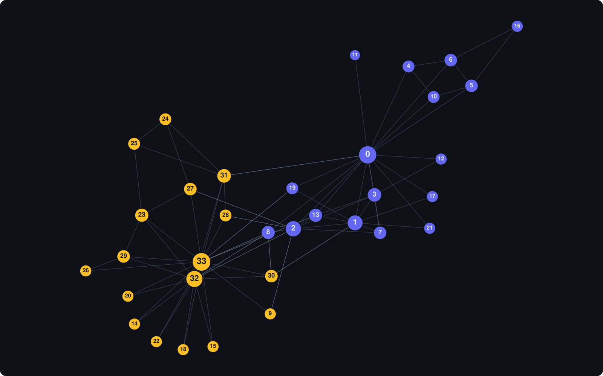
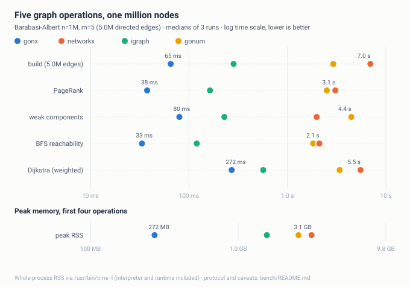

# gonx

[](https://github.com/LuisLSousa/gonx/actions/workflows/ci.yml)

A performance-oriented graph library for Go, in the spirit of Python's
[networkx](https://networkx.org/) but built around dense integer node IDs and a
compact, cache-friendly representation.

`gonx` targets workloads that build a graph once and then read it intensively,
such as agent-based simulations, network metrics, and repeated traversals. It
separates mutation from reading: a `Builder` assembles the topology, then
freezes into an immutable `Graph` stored in [Compressed Sparse Row](https://en.wikipedia.org/wiki/Sparse_matrix#Compressed_sparse_row_(CSR,_CRS_or_Yale_format))
form with zero-copy, O(1) access to sorted neighbor slices.

```go
import (
    "github.com/LuisLSousa/gonx"
    "github.com/LuisLSousa/gonx/generators"
    "github.com/LuisLSousa/gonx/metrics"
)

r := gonx.NewRand(42)                                  // reproducible PCG RNG
g, _ := generators.WattsStrogatz(1000, 8, 0.1, r)      // small-world graph

apl, _ := metrics.AveragePathLength(g)                 // parallel all-pairs BFS
cc := metrics.Transitivity(g)                          // global clustering

for u := range g.Nodes() {
    for _, v := range g.Neighbors(u) {                 // zero-alloc, cache-friendly
        _ = v
    }
}
```

## Gallery

Every image below is produced by a runnable example in [`examples/`](examples/):
gonx builds the graph, and a small dependency-free helper
([`examples/internal/render`](examples/internal/render)) does the force-directed
layout and writes the SVG. Regenerate any of them from the repo root, e.g.
`go run ./examples/scalefree`.



**Scale-free network** — Barabási–Albert preferential attachment; nodes sized and
colored by degree, so the hubs glow.

```go
r := gonx.NewRand(7)
g, _ := generators.BarabasiAlbert(150, 2, r) // 150 nodes, 2 edges per arrival
```



**Small-world network** — Watts–Strogatz ring lattice with 12% of edges rewired;
the long-range shortcuts that collapse path lengths are drawn in cyan.

```go
r := gonx.NewRand(11)
g, _ := generators.WattsStrogatz(48, 4, 0.12, r) // k=4 ring, p=0.12 rewiring
```



**Community structure** — a planted partition assembled with `Builder`: four dense
blocks with sparse bridges between them, colored by block.

```go
b := gonx.NewBuilder(88) // 4 blocks of 22 nodes
for u := 0; u < 88; u++ {
    for v := u + 1; v < 88; v++ {
        p := 0.005                       // sparse between blocks...
        if u/22 == v/22 { p = 0.28 }     // ...dense inside them
        if r.Float64() < p { b.AddEdge(u, v) }
    }
}
g := b.Build()
```



**Zachary's Karate Club** — the classic 34-member social network, colored by the
faction each member joined after the club split (indigo: Mr. Hi, node 0; amber:
the Officer, node 33) and sized by degree.

```go
b := gonx.NewBuilder(34)
for _, e := range zacharyEdges { // the standard 78-edge list
    b.AddEdge(e[0], e[1])
}
g := b.Build()
```

## Design

- **Dense integer nodes.** IDs are `0..N-1` (up to 2³¹−1 nodes and adjacency
  entries — enforced, not silently overflowed). No generic node types in the
  core — that would reintroduce a map indirection and defeat CSR's locality. A
  labeled wrapper can sit on top if needed.
- **Immutable `Graph` (CSR).** Neighbors of `u` live in a contiguous, sorted slice
  returned zero-copy by `Neighbors(u)`; `NeighborsSeq(u)` wraps the same data as
  an `iter.Seq[int]` for callers who prefer plain ints. `HasEdge` is O(log deg)
  via binary search.
- **Mutable `Builder`.** Add/remove nodes and edges, then `Build()` to freeze.
  The result is always simple (no self-loops or duplicate edges).
- **Optional edge weights.** `AddEdgeW` puts a `float64` on an edge, or
  `NewWeightedBuilder` makes every edge weighted from the start. Weights are
  stored in an array laid out exactly like the adjacency, so `Weights(u)[i]`
  belongs to `Neighbors(u)[i]`, and an unweighted graph stores no weight array.
  `EdgeOffset` and `EdgeIndex` expose that layout, so per-edge data of your own
  can live in a plain slice indexed the same way.
- **Directed graphs.** `Digraph`/`DigraphBuilder` mirror the undirected pair, with
  the CSR stored in *both* directions: `OutNeighbors(u)` and `InNeighbors(u)` are
  equally cheap, which is what reverse-flow algorithms like PageRank and "who
  links here" queries need. Built for
  [The Shape of Go](https://luislsousa.com/blog/the-shape-of-go), which maps
  all 2.6 million public Go modules and their 9.4 million dependency edges.
- **One traversal interface.** `Adjacency` is the read-only view `Graph` and
  `Digraph` share: node count, out-neighbors, out-weights. An algorithm that
  only walks edges forward takes an `Adjacency` and runs on either kind from
  one implementation. It is sealed to this package for now.
- **Views with parts hidden.** `RestrictedView(g, nodes, edges)`, after
  networkx's `restricted_view`, hides nodes and edges without copying the
  graph, and is an `Adjacency` itself, so "the shortest path if this edge were
  gone" is `ShortestPath` on a view. Only the lists that lose an entry are
  copied; every other node reads the graph's own slices.
- **Reproducible randomness.** Every randomized operation takes an explicit
  `*math/rand/v2.Rand`. The same seed and parameters give a byte-identical graph. The package
  never touches a global RNG.
- **Parallel where it pays.** All-pairs shortest paths and triangle counting are
  parallelized over independent source nodes with order-independent reductions, so
  results are deterministic regardless of `GOMAXPROCS`. Generators and edge swaps
  are inherently sequential and kept single-threaded.

## Packages

| Package | Contents |
|---|---|
| `gonx` | `Graph`/`Digraph` (CSR, optional edge weights), `Builder`/`DigraphBuilder` (+ `NewWeighted*`), `Adjacency`, `RestrictedView`, iterators, `NewRand` |
| `gonx/generators` | `WattsStrogatz`, `BarabasiAlbert`, `Complete`, `RandomAvgDegree`, `ErdosRenyi` |
| `gonx/transform` | `DoubleEdgeSwap`, `RelabelNodes`, `Shuffle`, `Copy` |
| `gonx/metrics` | `Transitivity`, `AverageClustering`, `AveragePathLength`(+`LCC`), `Diameter`, `ConnectedComponents`, `IsConnected`, `BFS`/`BreadthFirst`, `Dijkstra`, `ShortestPath`, `PathFinder`, `Bridges`, `ArticulationPoints`, `PageRank`, `WeaklyConnectedComponents` |

> Note on `BarabasiAlbert(n, m, r)`: `m` is the number of edges added per new node
> (matching networkx), **not** the average degree — the resulting average degree
> is approximately `2m`.

## Benchmarks

Measured against networkx, python-igraph, and gonum/graph on identical
seeded inputs, with cross-library answer checks; the full harness,
protocol, and caveats live in [`bench/`](bench/) and every number below
reproduces with `cd bench && ./run.sh`.



Medians of 3 runs on a Barabási–Albert graph with 1M nodes / 5.0M
directed edges (Apple M3 Max; ratio vs gonx in parentheses):

| operation | gonx | networkx | igraph | gonum |
|---|---|---|---|---|
| build | **68 ms** | 7.7 s (113×) | 300 ms (4.4×) | 3.1 s (45×) |
| PageRank | **39 ms** | 3.8 s (98×) | 191 ms (4.9×) | 2.8 s (73×) |
| weak components | 99 ms | 2.4 s (24×) | **22 ms (0.2×)** | 5.1 s (52×) |
| BFS reachability | **33 ms** | 2.3 s (68×) | 146 ms (4.4×) | 2.0 s (61×) |
| Dijkstra (weighted) | **351 ms** | 6.2 s (18×) | 696 ms (2.0×) | 3.7 s (11×) |
| peak memory | **279 MB** | 3.0 GB | 1.5 GB | 2.4 GB |
| peak memory, Dijkstra run | **436 MB** | 2.6 GB | 1.0 GB | 2.0 GB |

igraph's C core wins weak components outright. networkx is the slowest
but implements far more algorithms. The first memory row covers the four
unweighted operations; Dijkstra runs in a separate process on a weighted copy
of the graph and has its own row. The table measures these five operations on
this workload, nothing broader.

## Status

v1 focused on undirected, unweighted graphs; v1.1 added directed graphs
(`Digraph`), `PageRank`, and `WeaklyConnectedComponents`, extracted from real
usage mapping the full Go module dependency graph (2.6M nodes, 9.4M edges).
Both graph kinds now carry optional edge weights and share the `Adjacency`
traversal interface, whose first consumers are `BreadthFirst`, `Dijkstra` and
`ShortestPath`. Generic node labels, serialization, and community detection
remain intentionally out of scope.

## Testing

```sh
go test ./... -race        # unit, property, determinism, known-value tests
go test -bench . -benchmem  # benchmarks
go test -fuzz FuzzDoubleEdgeSwap ./transform   # degree-preservation fuzzing
```

## License

MIT, see [LICENSE](LICENSE).
